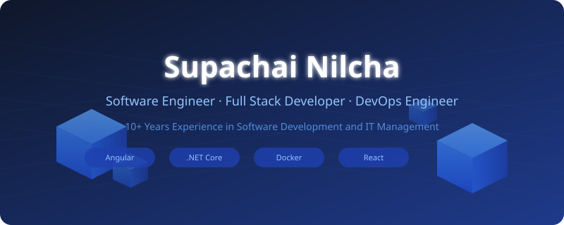
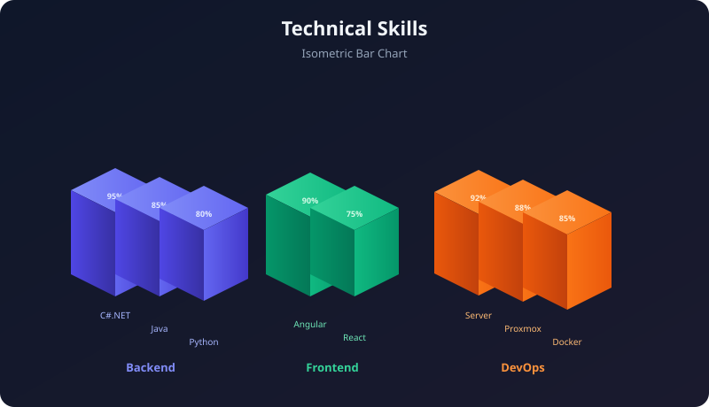
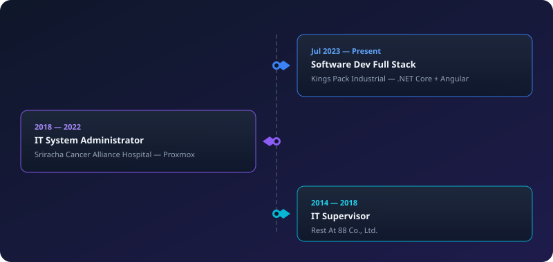

<!-- 🔷 ISOMETRIC HERO HEADER -->

---

## 👤 เกี่ยวกับฉัน

> วิศวกรซอฟต์แวร์และ DevOps ที่มีประสบการณ์มากกว่า **10 ปี**
> เชี่ยวชาญในการพัฒนาแอปพลิเคชันเว็บแบบ Full Stack และการบริหารจัดการระบบไอทีขนาดใหญ่
> ปัจจุบันรับผิดชอบการพัฒนาและบำรุงรักษาระบบด้วย **.NET Core + Angular**

| | |
|---|---|
| 📍 **ที่อยู่** | ชลบุรี, ประเทศไทย |
| 📧 **อีเมล** | picthaisky00@gmail.com |
| 📱 **โทรศัพท์** | 099-179-5582 |
| 🔗 **GitHub** | [github.com/picthaisky](https://github.com/picthaisky) |

---

## 🧊 Technical Skills

### สรุปทักษะ

| Category | Technologies |
|:---:|:---|
| **🖥️ Backend** | `C# .NET Core` · `ASP.NET Web API` · `Java Spring Boot` · `Python` |
| **🎨 Frontend** | `Angular` · `Material UI` · `React` · `JavaScript` |
| **⚙️ DevOps** | `Docker` · `Git` · `Nginx` · `IIS` · `GitHub Actions` |
| **🏗️ Infrastructure** | `Windows Server` · `Linux Server` · `Proxmox VE` |
| **🗄️ Database** | `MS SQL Server` · `MySQL` · `MongoDB` · `Oracle` |

---

## 💼 ประสบการณ์การทำงาน

### รายละเอียด

<strong>🔵 Software Development Full Stack — Kings Pack Industrial (ก.ค. 2566 - ปัจจุบัน)</strong>

- พัฒนาและบำรุงรักษาเว็บแอปพลิเคชันด้วย .NET Core และ Angular
- ออกแบบระบบฐานข้อมูลและ API
- ให้คำปรึกษาและ Mentor นักพัฒนา

<strong>🟣 IT System Administrator — Sriracha Cancer Alliance Hospital (2561 - 2565)</strong>

- ออกแบบและบริหารจัดการโครงสร้างพื้นฐานไอทีทั้งหมด
- นำทีมวางแผน Disaster Recovery และ Virtualization (Proxmox)

<strong>🔷 IT Supervisor — Rest At 88 Co., Ltd. (2557 - 2561)</strong>

- นำทีมไอทีและวางกลยุทธ์เทคโนโลยี
- พัฒนาทีมและกระบวนการทำงาน

---

## 📂 ผลงานและ GitHub

---

© 2026 Supachai Nilcha · Built with 🧊 3D Isometric Style

